# Raylib Racers 2

A small, fast TORCS-style racing simulator for testing driving algorithms.
Cars are driven by **robots**: shared libraries written in C or C++ that read
sensors and return steering, throttle and brake. Races run headless at hundreds
of times real time for experiments, or in a raylib 3D viewer to watch them.

**New in Raylib Racers 2** (Raylib Racers 1 is tagged `v1.0`):

- **Hills and banking.** Tracks carry a height and a bank angle per control point;
  the car feels grade, banking, crests and compressions, and robots get the 3D
  track (robot API version 9). The new test track, **Highmoor Ridge** (4.6 km,
  37 m of climb and drop, a banked summit hairpin, a corkscrew), is built on it.
- **A new renderer** (`rr_viewer2`): physically based materials, HDRI sky lighting,
  cascaded sun shadows, 4x MSAA, instanced trees with levels of detail and
  baked terrain occlusion; 2013 F1 cars with clear-coat paint, steering front
  wheels, a turning steering wheel and a suspension that rolls, pitches and squats.
  The menu, HUD, testing screens and director are Raylib Racers 1's, unchanged.
- **A 2013 car** (`specs/f1_2013.json`): 642 kg, a 2.4 l V8 (560 kW at 18,000 rpm),
  about 3 g of downforce, no refuelling (a fixed start load, tyre-only stops) and
  305 km races, KERS (2014-style: 120 kW, 4 MJ a lap) and DRS (detection zones, 1 s rule).
- **A V8 sound**: eight firings a cycle through a recorded F1 exhaust response, with
  gearshift effects and the odd pop.

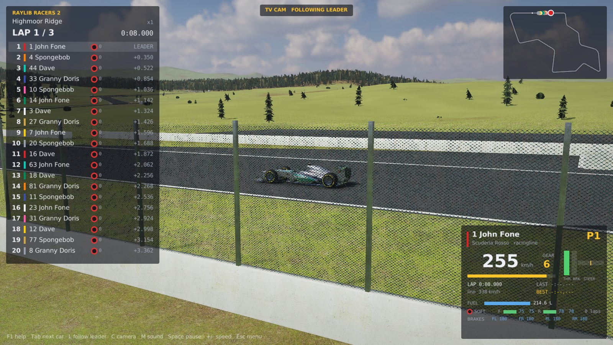

## What is in the box

- **Simulation core** (`src/core`, no graphics dependency): spline tracks, a
  planar dynamic-bicycle car model (load transfer, aero drag and downforce,
  tyre load sensitivity, friction circle, engine torque curve and gearbox),
  barrier and car-to-car collisions, lap timing and classification. Fixed 500 Hz
  physics, robots called at 50 Hz, fully deterministic.
- **Race mechanics**: fuel load and consumption, tyre wear with grip loss
  (soft, medium and hard compounds, each with a temperature window), dirty air, damage that costs downforce, power and grip, slipstream,
  and a pit lane with a speed limiter, a box per car and timed service (fuel,
  tyres, repairs). After the flag each car runs a slow lap into the pit lane
  and parks behind its box.
- **Robot API** (`include/rr/robot_api.h`): one C header. Sensors follow the
  TORCS SCR championship (angle, track position, 19 range finders, 36 opponent
  sectors) plus the full track geometry and the car's pose, as TORCS robots get,
  the car's fuel, tyre and pit state, and the nearest cars for racecraft.
  Robots can take parameters from the command line, print status text, log
  debug values to telemetry and draw a path in the viewer.
- **Example robots** (`bots/`): `simple` (C, sensors only), `gapfollow`
  (C++, sensors only) and `racingline` (C++, plans a minimum-curvature line and
  speed profile, plans its own pit strategy from the timing screen, overtakes
  and defends). In practice it runs each tyre compound, measures pace, wear and
  fuel, and uses what it learned in qualifying and the race. The default grid
  drivers John F One, Spongebob, Dave and Granny Doris are racingline with their
  own driving styles.
- **Race weekends and championships**: practice, qualifying and race, with
  notes a robot keeps across the weekend; seasons over a calendar of tracks
  with saved standings and lineups. Robots run in a sandbox with a CPU cap
  (see [docs/COMPETITION.md](docs/COMPETITION.md)).
- **`rr_race`**: headless runner with JSON results and per-car CSV telemetry.
  A 5-car, 3-lap race on the 3.2 km circuit takes about one second.
- **`rr_viewer`**: raylib 3D viewer with low-poly F1 cars in team liveries
  (steering, rolling wheels), sun shadows, fog, procedural textures, kerbs,
  barriers, pit lane and boxes, scenery, eight cameras including an automatic
  director (F9), three graphics quality levels (F10), a timing tower (with
  tyres and pit status), minimap, a per-car panel with fuel, tyre wear and
  tyre and brake temperatures, a menu for quick races, weekends, championships
  and testing, and race-end windows (results, positions, lap chart, lap times,
  strategy, incidents).

| | |
|---|---|
| 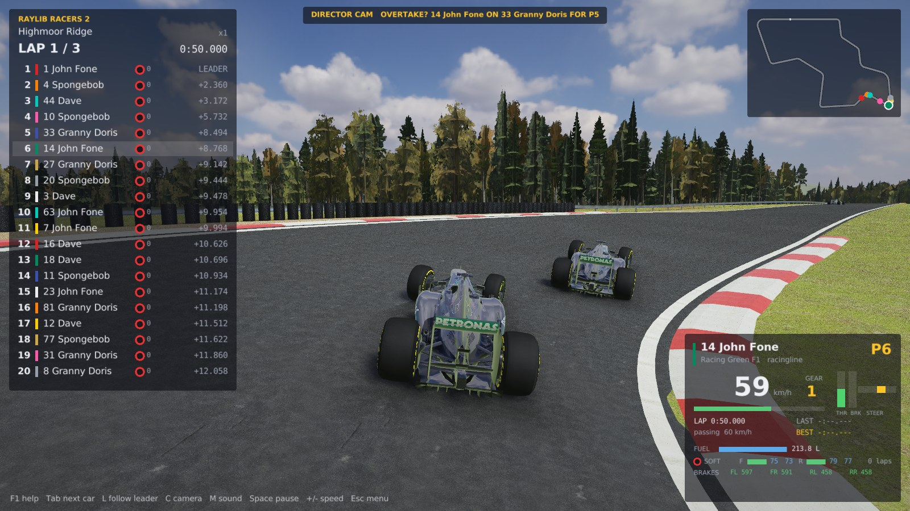 | 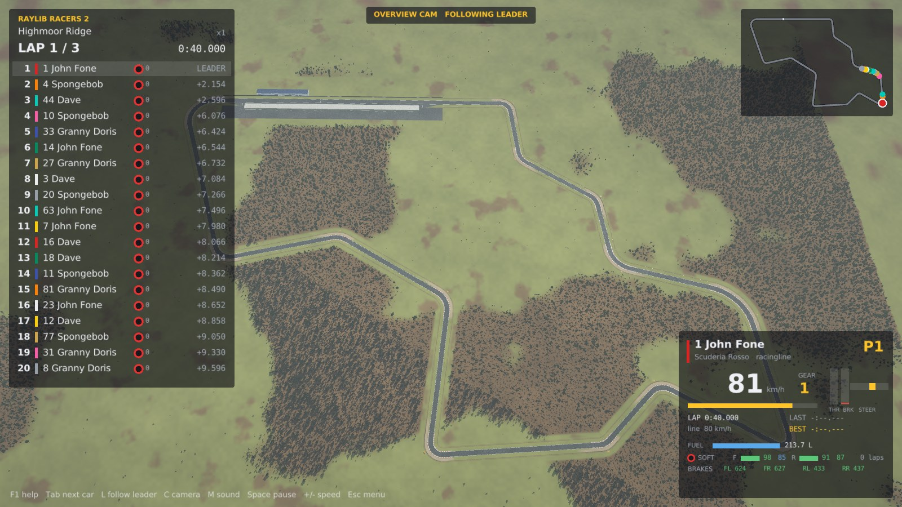 |
| 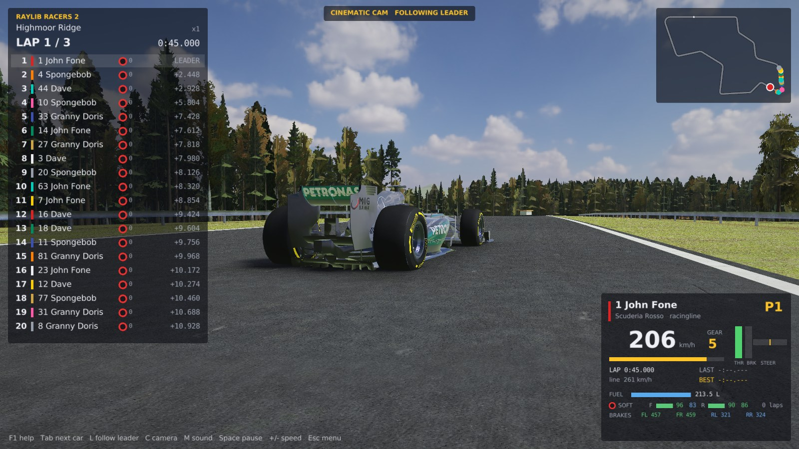 | 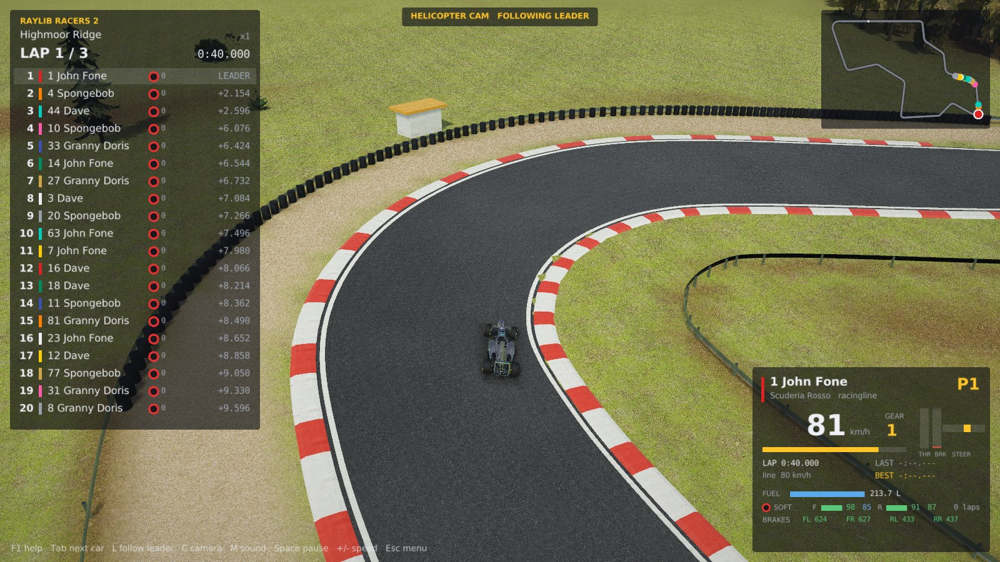 |
| 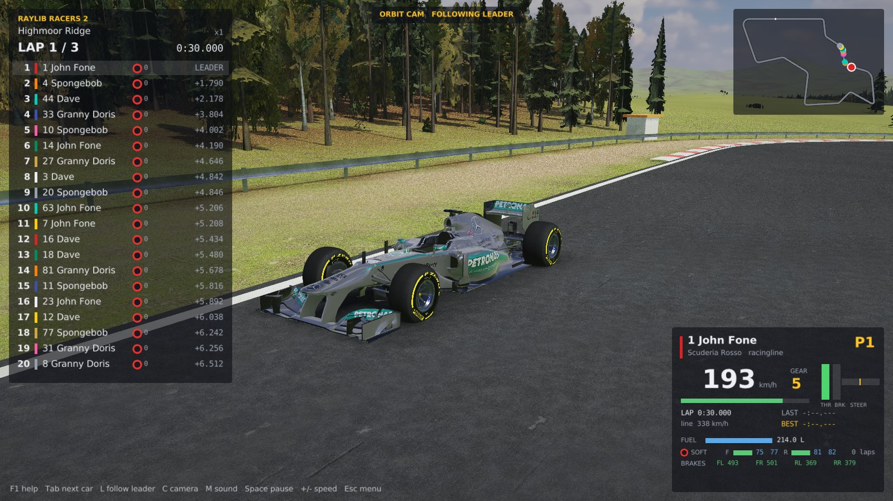 | 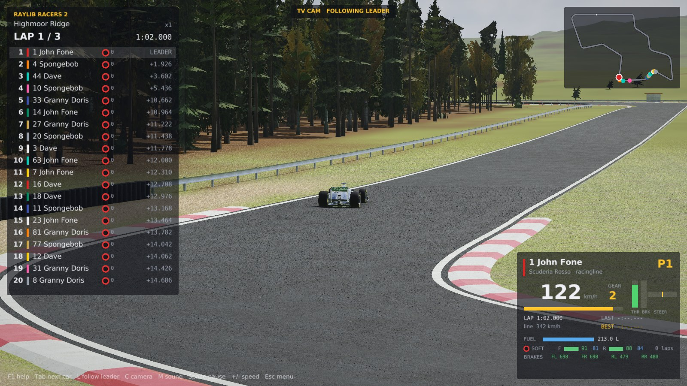 |
| 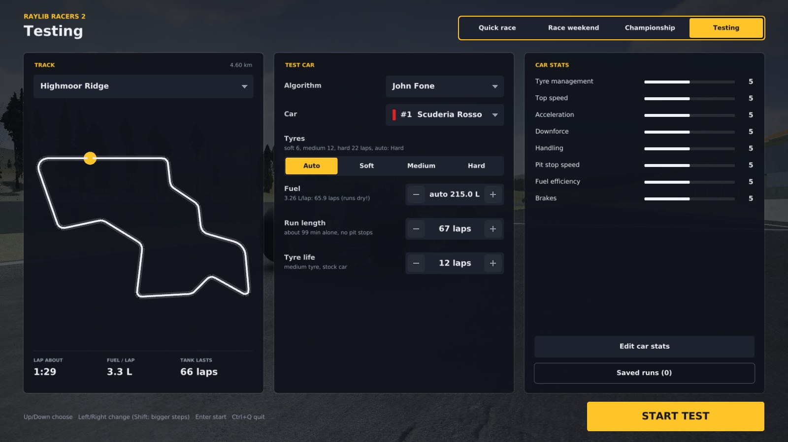 | 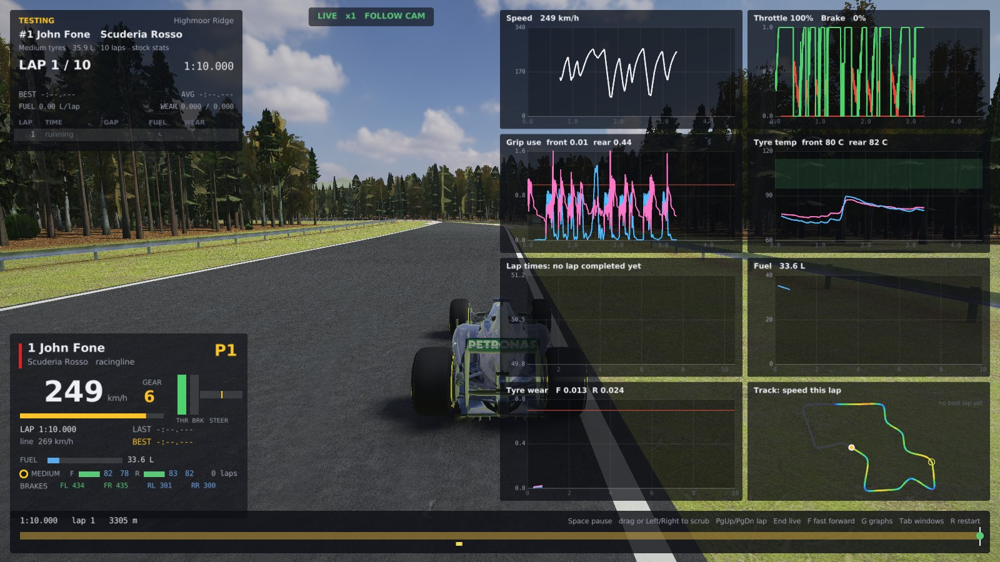 |
| 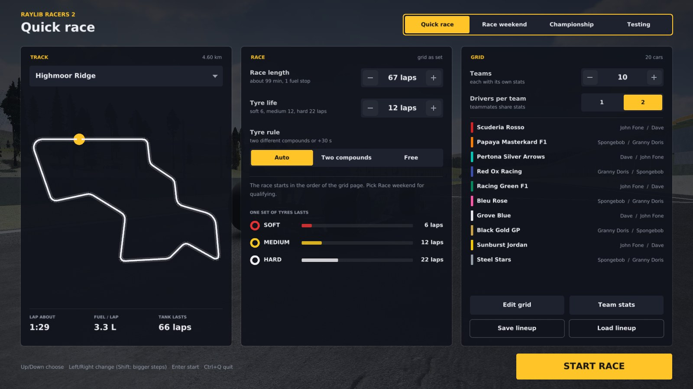 | 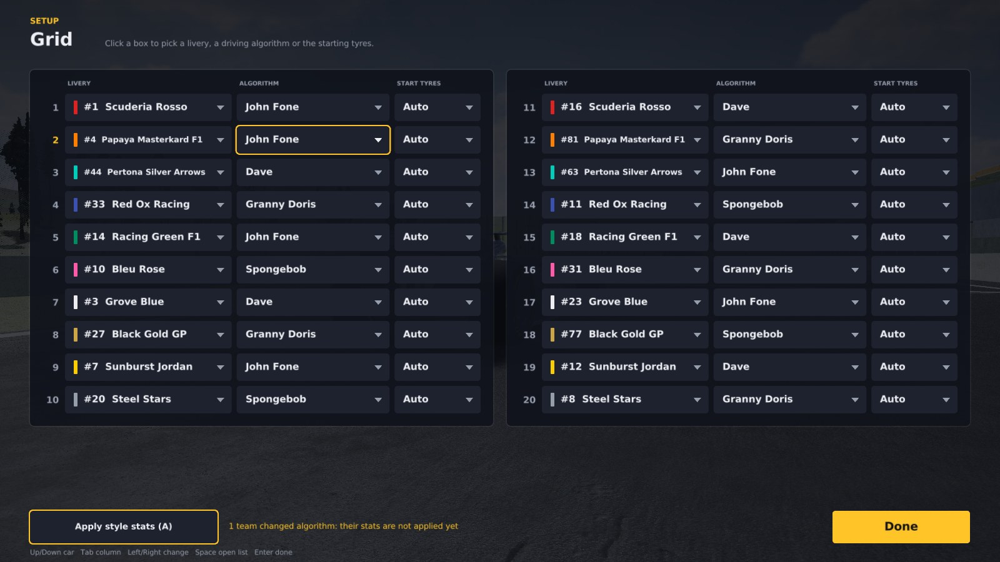 |
| 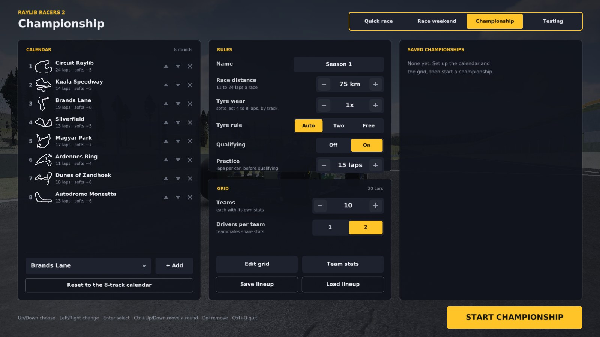 | 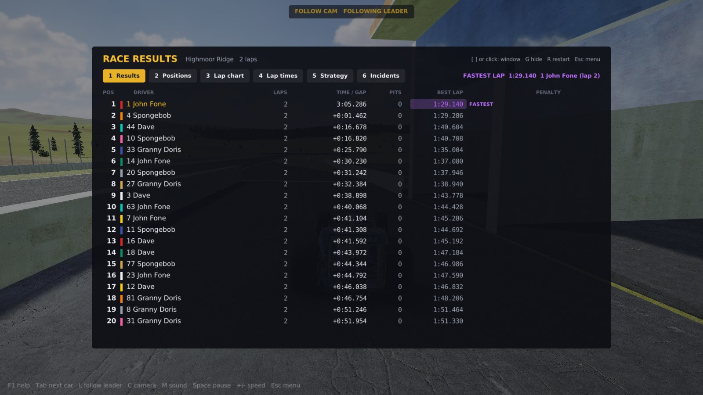 |
| 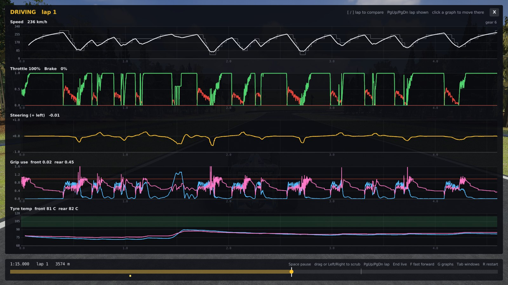 | 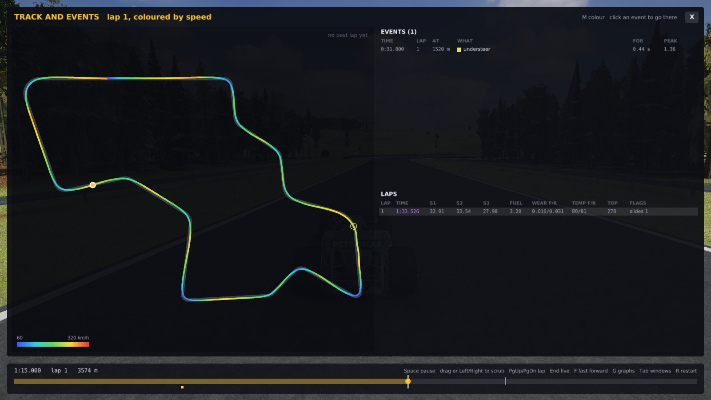 |
| 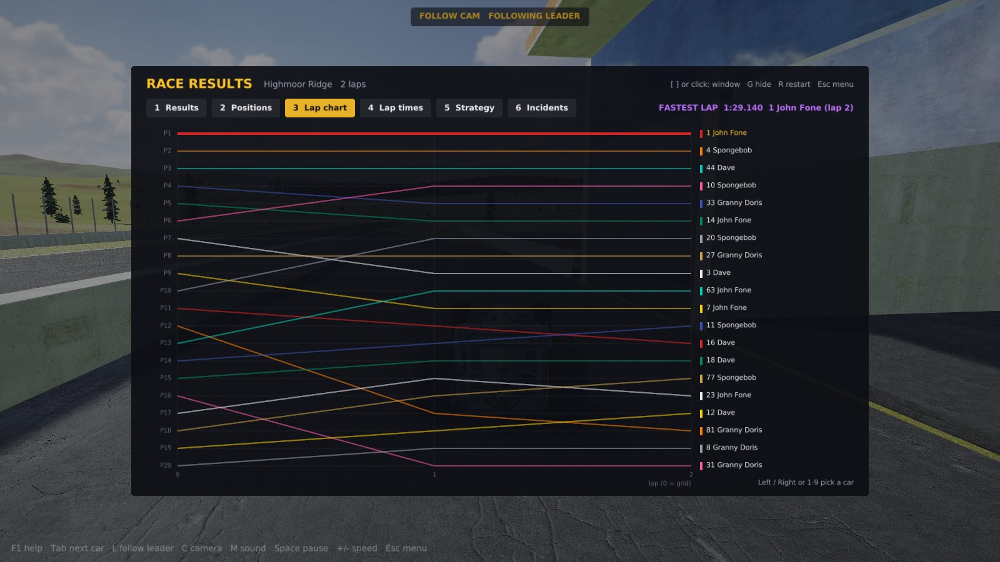 | |

## Build

Needs CMake 3.16+ and a C++17 compiler. The viewer needs raylib 5.5: if it is
not installed, CMake downloads and builds it.

```sh
cmake -S . -B build -DCMAKE_BUILD_TYPE=Release
cmake --build build -j
ctest --test-dir build          # quick smoke races
```

- **Linux**: raylib needs the X11/OpenGL headers, e.g. on Debian/Ubuntu
  `sudo apt install libx11-dev libxrandr-dev libxinerama-dev libxcursor-dev libxi-dev libgl1-mesa-dev`.
- **Headless only** (servers, CI, sweeps): `-DRR_BUILD_VIEWER=OFF` skips raylib entirely.
- macOS and Windows should work (the loader handles `.dylib`/`.dll`) but have
  not been tried yet.

## Run

```sh
./build/rr_viewer                                   # watch the example robots race
./build/rr_viewer --track oval --laps 5 --car racingline --car gapfollow
./build/rr_race --laps 3 --car racingline --car simple --json results.json
./build/rr_race --car racingline --params "grip=0.85,brake=0.7" --telemetry tel/
./build/rr_race --laps 25 --car racingline --car racingline --params "tires=1"   # full-length race with stops
./build/rr_viewer --laps 8 --wear-rate 6 --focus 0          # short race, tyres wear fast enough to force a stop
```

`--car` takes a robot name from `build/bots/` or a path to any robot library;
`--params`, `--name`, `--spec`, `--dev` and `--tires soft|medium|hard` (the
team's choice of starting tyres, overriding the robot's) apply to the car before
them. `--help` lists all options (noise on the range finders, physics step,
robot rate, time limit, `--fuel-rate` and `--wear-rate` multipliers,
`--ambient` temperature, `--two-compounds on|off|auto`, `--cool-down` to run on
until the cars have parked after the flag).

**Two-compound rule.** By default a race longer than 20 laps requires every car
to use two different compounds; a car that finishes without doing so gets 30 s
added. `--two-compounds on|off` forces it either way. Qualifying runs never
apply it.

**Race logs.** `--json FILE` writes the results with every car's lap times,
its position at the end of each lap (`lap_positions`) and a `stops` entry per
pit stop: lap, fuel before and added, tyre wear and compound before and after,
damage, whether it was repaired, service time and the algorithm's stated
reason (`box (plan)`, `box (undercut)`, `box (fuel)`, `box (damage)`...),
average and peak tyre temperatures front and rear for every lap
(`lap_tire_temps`) and each penalty with its lap, seconds and reason
(`penalty_log`). The
viewer writes the same log when a race ends, to `race_logs/` next to
`rr_viewer` (or to `--json FILE`), and shows the path on the results screen.

The viewer opens on a **race setup** menu: track, race length, tyre life
(in laps of the chosen track; the menu measures a lap first), number of cars
(up to 20: ten teams of two, each with its own number), the session, the tyre
rule and a **Grid** page where each car gets a livery, a driving algorithm (any
robot library in `bots/` shows up there) and its starting tyres (Auto lets the
algorithm choose). **Weekend** mode runs qualifying first:
each car goes out alone for an out lap and two flying laps, and the fastest
lap takes pole. `Enter` skips the current run, `Shift+Enter` the rest of
qualifying. `--no-menu` skips the menu. The default grid runs the four
racingline family in turn, four robots that share one driving code:
**John F One** (`racingline`, the standard), **Spongebob** (`spongebob`:
`grip=0.85,brake=0.75,push=1.3,attack=1.4,heat=15`, brakes later, learns closer
to the limit, follows closer, goes for gaps sooner and runs its tyres hotter),
**Dave** (`dave`: `grip=0.75`, careful) and **Granny Doris** (`granny`:
`grip=0.7,brake=0.6,heat=0`, smooth and easy on the tyres). Each is its own
library in `bots/`, so `--car spongebob` works in `rr_race` too, and params
given at race time still override its defaults. `gapfollow` and `simple` are
still on the Grid page.

When the race ends the results come up in six windows (`[` `]`, PgUp/PgDn or
click the tabs; `G` hides them): **Results** with the fastest lap highlighted,
**Positions** (grid against finish, places gained and lost), **Lap chart**
(every car's position lap by lap, the selected car on top), **Lap times**
(best, average, spread and every lap as a bar), **Strategy** (tyre stints and
stops, repair-only stops in red) and **Incidents** (contacts, penalties, blue
flags, repairs, damage and the hardest contacts).

**Testing** (the Session row's third choice) puts one car on track alone, with
no pit stops, to collect data and train a single algorithm. The setup page
picks the algorithm, the car (livery), the tyres and the fuel (Auto: the
softest compound that lasts the run, and the fuel for the run plus a lap with
this car's stats; Left/Right sets your own, Backspace goes back to Auto) and
the car's stats. While you change the stats, the **Car stats** page shows what
they do to the car: engine power, top speed, 0-200 km/h and braking distance
(measured with the car physics), downforce, drag, cornering grip, agility,
pit service time, fuel use and tyre life on this track, with the figures the
selected stat changes highlighted.

On track, the testing screen shows the session (every lap with its gap to
the best, fuel and tyre wear, and the delta to the best lap as you drive),
the car panel, a **dashboard** of eight graphs (speed, throttle and brake,
grip use, tyre temperatures against the compound's window, lap times, fuel with its average per lap and
where it runs dry, tyre wear with its average per lap and the lap it reaches
the cliff, and a track map coloured by speed with the live delta to the best
lap on top) and a **timeline** of the run
with each lap and every flagged moment (off track, contact, oversteer,
understeer, wheelspin, spin, stopped). Click a graph, or press `Tab`, for a
full window: **Driving** (speed and gear, pedals, steering, grip use and tyre
temperatures along the lap, against the best lap or any lap with `[` `]`), **Session**
(lap times, sector times, fuel, tyre wear, tyre temperatures over the run) and
**Track and events** (the lap on the map coloured by speed, pedals or grip
use with `M` and the live delta to the best lap, the list of events and a lap table).

Scrubbing: pause with `Space` and drag the timeline or use `Left`/`Right`
(1 s, `Shift` 10 s, `Ctrl` one sample), `PgUp`/`PgDn` (the same spot a lap
earlier or later), `Home`/`End`; the car, the graphs and the panels show that
moment. `Space` plays on from there and goes back to live when it catches up.
Clicking a lap, an event or a point on a Driving graph jumps there. After the
run the whole of it can be scrubbed and played. `F` fast-forwards (as fast as
the computer runs), `R` restarts, `G` hides the graphs, `Esc` closes a window
or goes back to the menu.

Every run is saved, in `test_runs/` next to `rr_viewer`: `runs.json` lists
every run's setup and results (best and average lap, fuel and wear per lap,
all lap times) and is never pruned; `run_NNNN/summary.json` has the lap table
and the events; `run_NNNN/telemetry.csv` the car 25 times a second, kept for
the 10 newest runs of each algorithm. `test_runs/README.md` explains every
column, so the folder can be handed to an AI tool as it is. The **Saved runs**
page lists them, newest first or by best lap, on this track or all, loads a
run's setup back into the menu (`Enter`) and replays its telemetry (`V`).
`rr_race --test-log DIR --no-pits --car ...` records and saves a run the same
way without a window.

**Championships** run a season over a calendar of tracks with the modern F1
points (25-18-15-12-10-8-6-4-2-1 for the top ten, no fastest-lap point),
driver and constructor standings, and countback (most wins, then most seconds,
and so on) for ties. The lineup (teams, their stats and their drivers) is fixed
for the whole season. A season is a JSON file that can be resumed. Without a
window:

```
./build/rr_race --save-lineup my_grid.json --car racingline --dev "top_speed=7,brakes=3" --car dave --car spongebob --car granny
./build/rr_race --championship season.json --lineup my_grid.json --laps 10   # round 1 of the 8-track calendar
./build/rr_race --championship season.json --all-rounds                     # the rest of the season
```

`--rounds monza:10,spa:8` picks a custom calendar. The default calendar is
Circuit Raylib, Kuala Speedway, Brands Lane, Silverfield, Magyar Park, Ardennes
Ring, Dunes of Zandhoek and Autodromo Monzetta. The first round's grid follows
the lineup, and later grids follow the standings. Races stay deterministic, so
the same season gives the same results.

The engine sound is synthesised from each car's revs and throttle (a V10 with
overrun pops and a rev limiter), for the cars nearest the camera. `M` mutes it;
`rr_viewer --sound-test out.wav --at 20` writes 25 s of it to a file.

Click a car in the timing tower to watch it. Viewer keys: `Tab`/arrows change car, `1`-`9` focus by position, `L` goes back
to following the leader (the default), `C` / `Shift+C` cycle the cameras and
`F2`-`F8` pick one: follow, cinematic (eases between framings around the car),
TV, helicopter, top down, orbit, overview. The mouse wheel zooms the orbit,
helicopter and top-down cameras. `Space` pauses, `+`/`-` change speed
(up to 64x), `N` single-steps while paused, `R` restarts, `P` toggles robot
paths, `S` shows the focused car's range finders, `M` mutes, `Esc` returns to
the menu, `H` hides the HUD, `F1` help.

To grab a frame without a window manager (e.g. under `xvfb-run`):
`rr_viewer --screenshot shot.png --at 30 --camera 1`. With `--test` the
viewer opens on the Testing session (and `--no-menu` or `--at` starts the
run); `--test-view N` and `--scrub T` pick the testing window and moment.
`--results N` picks the race-end window (1-6) and `--page grid|stats|runs`
opens a menu page.

## Car physics

A planar car with per-wheel loads: weight and downforce per axle, longitudinal
load transfer between the axles and lateral transfer between left and right,
split by the roll stiffness (56% front), lagging the accelerations like a
sprung car. Each wheel has its own load-sensitive tyre (a magic-formula curve
peaking around 6° of slip) and friction circle, so a lightly loaded inside
rear spins first and the limited-slip diff hands some of its drive to the
outside wheel. Downforce has a balance that moves forward under braking and
fades when the car slides sideways. On tracks with hills (Highmoor Ridge),
gravity slows the car uphill and speeds it downhill, banking holds it into a
turn and adds load, and the tyre load follows the road's vertical curvature:
grip builds in a compression and drops over a crest. Robots see `grip_use` and `slip_angle`
per axle, so under- and oversteer show up in telemetry
(`--telemetry DIR` writes them per car).

Tyres have a temperature per axle and a working window per compound (soft
85-105 °C, medium 95-115, hard 105-125). Sliding and rolling heat them, the
airflow cools them; cold tyres lose grip and grain, overheated ones lose grip
and wear several times faster, so driving hard costs tyre life. They leave the
warmers at 80 °C, so the first lap and the out lap after a stop are slower.
Fuel weight costs about a second a lap from a full tank to an empty one (tyre
load sensitivity is measured against the dry car). A car within 40 m behind
another loses up to 10% of its downforce in the dirty air, mostly at the
front, while the slipstream (up to 60 m back) cuts its drag. The car panel in
the viewer shows each axle's tyre temperature: blue cold, green in the
window, amber and red hot.

The timing tower shows each car's compound, its age in laps and its number of
stops. When the focused car's algorithm publishes its plan, the car panel shows
the window of its next stop and the tyres it will fit, and warns when the
two-compound rule still wants a second compound.

## Blue flags

A car about to be lapped gets a blue flag when the lapping car is within 60 m
(or 1.2 s) behind. Holding it up within 30 m for more than 8 s costs a 5 s
time penalty (once per lapping car), added to the race time. The timing tower shows blue-flagged
cars in blue and the car panel says who to let by.

## Car specs and team stats

Car numbers are data: `specs/f1_2006.json` lists every physics parameter of
the built-in car (any field left out keeps the default), and
`--spec FILE|NAME` gives a car another spec.

On top of the spec, each team rates its car in eight stats from 0 to 10, where
5 is the stock car and a team has 40 points in all, so raising one stat means
lowering another. `specs/development.json` defines them. Each point away from
5 changes the car linearly:

| Stat | Per point | 0 to 10 is worth |
|---|---|---|
| Tyre management | wear -5%, sliding heat -2% | tyre wear from +25% to -25% |
| Top speed | drag -0.8% | about 0.3 s a lap |
| Acceleration | engine torque +0.9% | about 0.25 s a lap |
| Downforce | downforce +0.6%, drag +0.2% | about 0.25 s a lap |
| Handling | mechanical grip +0.15%, yaw inertia -0.4% | about 0.3 s a lap |
| Pit stop speed | service time -4% | stops 20% longer to 20% shorter |
| Fuel efficiency | fuel per lap -1.6% | fuel use from +8% to -8% |
| Brakes | brake force +3% | little on Circuit Raylib, which has few big stops |

The lap times are on Circuit Raylib, so a full 0-to-10 swing in one stat is a
few tenths a lap, the gap between neighbouring top teams.
`--dev "top_speed=8,downforce=3"` sets one car's stats (stats left out stay at
5); over 40 points, outside 0-10 or an unknown stat is an error. The car's
spec reaches its robot through `RRCarSpec`, so planners adapt to it.

In the viewer the **Team stats** page edits each team's stats. Teammates share
them. Changing a driver's algorithm leaves the stats alone; the Grid page's
**Apply style stats** button (`A`) gives each team whose algorithm changed the
stats that suit the algorithm it changed last (Spongebob wants tyre management,
Granny Doris spends on speed). **Drivers per team** races one or two cars per team.

```sh
./build/rr_race --laps 25 --car racingline --dev "top_speed=8,handling=8,tire_management=2,pit_stop=2" \
                          --car racingline --dev "tire_management=8,fuel_efficiency=7,top_speed=3,downforce=2"
```

## Writing a robot

See [docs/ROBOTS.md](docs/ROBOTS.md). In short: export
`rr_robot_entry()` returning an `RRRobotApi` with `create`, `drive` and
`destroy`; build it as a shared library; pass it with `--car path/to/bot.so`.

## Tracks

Tracks are text files (`tracks/*.trk`): a name, a default width, the runoff to
the barrier, an optional pit lane and a list of control points in race order,
joined by a Catmull-Rom spline. A control point can carry its own width, a road
height (`h=12`, metres) and a bank angle (`bank=6`, degrees, + raises the left
edge), as in `p 120 40 14 h=12 bank=6` (use `-` for the default width). The sim
uses them for gravity, banking and crest loads (see Car physics). The loader warns
when a corner is tighter than the track is wide or when the track overlaps
itself.

```
name My Track
width 14
runoff 7
pit left 20 80 420 500   # side, entry, lane start, lane end, exit (metres along the track)
pitspeed 22              # pit lane speed limit, m/s
gravel auto              # gravel traps outside the faster corners (auto, the default, or none)
offtrack grass           # what lies beyond the kerbs: grass (default), gravel, dirt, ...
surface gravel right 800 900 1.2 20   # type, side (left/right/both), from s, to s, metres out from the edge (optional)
p 0 0
p 300 0
p 400 120 16     # wider here
...
```

Surfaces (tarmac, kerb, grass, gravel, dirt, pit, runoff) each have their own grip and drag
(`surfaceProps` in `track.cpp`: kerbs keep 97% of the tarmac grip and add no bumps, grass 70%, gravel 55% with
more drag). Robots read the one under the car in `surface` (ABI 11). The viewer plays kerb rumble, grass and
gravel sounds, generated in `apps/viewer/surface_sound.cpp`.

Besides Circuit Raylib and the oval there are seven circuits inspired by real
ones (shape kept, details changed): Autodromo Monzetta (Monza), Ardennes Ring
(Spa), Silverfield (Silverstone), Magyar Park (Hungaroring), Brands Lane (Brands
Hatch), Dunes of Zandhoek (Zandvoort) and Kuala Speedway (Sepang).
`tools/trackgen.py` generates their `.trk` files: Brands Lane from a list of
rounded corners, the others from centrelines that `tools/tracetrack.py` traced
from circuit maps (`tools/track_refs/`), then bent, reshaped corner by corner and
given their own widths and pit lanes. `python3 tools/trackgen.py --plot DIR`
also draws a 2D map of each.

**Highmoor Ridge** (`highmoor`) is RR2's test track: an original 4.6 km hill circuit
with 37 m of elevation, a banked summit hairpin and a corkscrew that drops at 14%.
Its corners carry heights and banks in `tools/trackgen.py`, and `--plot` adds an
elevation profile.

### RR2 track view

`rr_trackview` draws a track in 3D with RR2's new renderer: the road built from the
track's heights and banking, kerbs, armco and concrete walls, gravel traps, tyre
walls, marshal posts, pit garages and a grandstand, conifer plantations and the
moorland around it with baked sky occlusion, lit by an HDRI sky and a sun with two
shadow cascades, all with PBR materials. No race or cars yet. `--bench` drives a lap
and prints the frame time (`--cam 1-4` picks the camera, `--msaa 1/2/4` the
anti-aliasing). Trees are instanced with a far level of detail, the terrain drops
to a coarser mesh and a baked colour map in the distance, and the far shadow
cascade is redrawn every third frame: about 180-250 fps at 1600x900 on an RTX 3060
laptop GPU.

```
./build/rr_trackview --track highmoor                # 1-4 cameras, F2 sky, [ ] turn the sky, F12 screenshot
./build/rr_trackview --shots shots/ --ssaa 2          # render the preset views to PNGs and exit
```

### Viewer v2

`rr_viewer2` is the Raylib Racers 1 viewer (same menu, HUD, testing screens, director,
race-end windows and keys, see "Run" above) with its renderer replaced by the PBR one:
`apps/viewer/main.cpp` is built with `RR2_RENDERER`, which swaps `Renderer` for
`apps/viewer2/renderer2.*`. It starts on Highmoor Ridge with the 2013 car spec
(`specs/f1_2013.json`: 642 kg, a 2.4 l V8 with 560 kW at 18,000 rpm, about 3 g of
downforce at 300 km/h; no refuelling: a fixed 215 l start load and tyre-only stops;
KERS and DRS are simulated, see `docs/ROBOTS.md`) and runs the fewest whole
laps over 305 km (67 laps of Highmoor Ridge) unless `--laps` is given. Only one 2013 car
model is bundled (the Mercedes, `assets/cars/f1_2013_02`): every team wears it for now.
The V8 sound plays through a recorded F1 exhaust response (`assets/sound`); `M` mutes.

```
./build/rr_viewer2                                   # the menu
./build/rr_viewer2 --test --no-menu --car racingline  # a testing run with the telemetry screens
./build/rr_viewer2 --no-menu --camera 7              # a race with the director camera
./build/rr_viewer2 --screenshot shot.png --at 40 --no-menu   # a screenshot of the race at 40 s
```

The materials and skies come from `tools/import_assets.py` (CC0, see
[CREDITS.md](CREDITS.md)).

## Layout

```
include/rr/robot_api.h   robot ABI (C)
src/core/                track, car physics, race, robot loader, CLI, car specs
apps/headless/           rr_race
apps/viewer/             rr_viewer (renderer, HUD, menu, testing screens; also rr_viewer2's main)
apps/viewer2/            rr_viewer2's renderer, and its car (clear coat, suspension)
apps/trackview/          the PBR renderer and the 3D track; rr_trackview
bots/                    example robots and shared helpers
tracks/                  circuit, oval and seven real-inspired circuits (.trk)
specs/                   car specs and development rules (JSON)
assets/fonts/            DejaVu fonts for the HUD (see DEJAVU_LICENSE.txt)
assets/materials/        PBR texture sets (albedo, normal, ORM); assets/sky/: HDRI skies
assets/cars/f1_gearari/  F1 car: body and wheel glTF, car.json, liveries (see its README)
```

## Current limits and next steps

- Hills and banking are simulated (grade, bank, crests and compressions), but
  `rr_viewer` still draws every track flat; `rr_viewer2` and `rr_trackview` draw the
  3D track. Only the Mercedes model is bundled, so every team wears it.
- Overtaking between closely matched cars is still rare. `gapfollow` and
  `simple` never pit, so in long races they run out of fuel or tyres.
- Possible next steps: a track editor, per-team car setups, parameter sweeps
  with a summary report, a Python binding for learning-based drivers, replay
  files, and a TORCS track importer.
